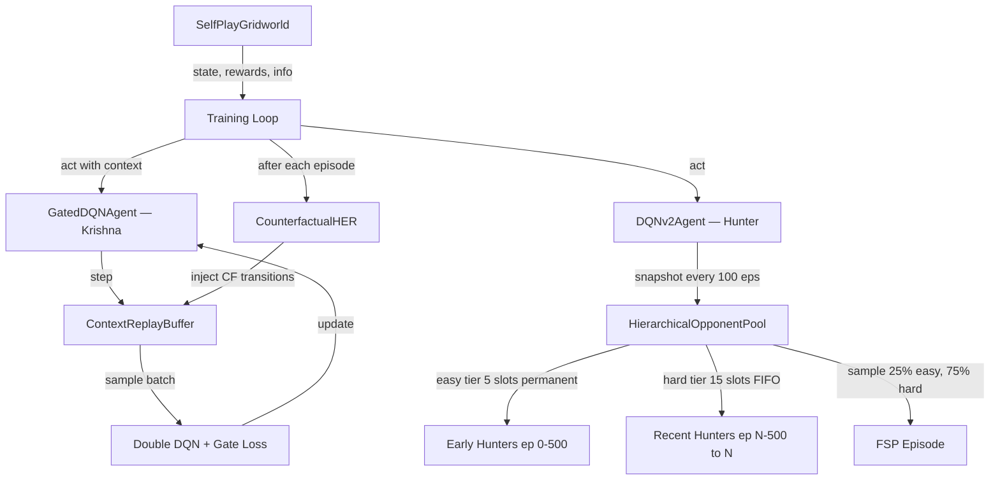
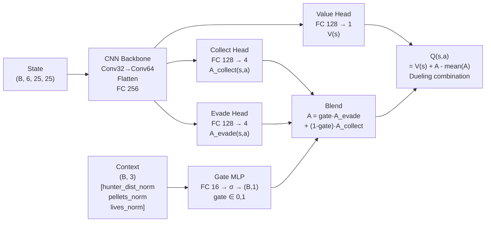
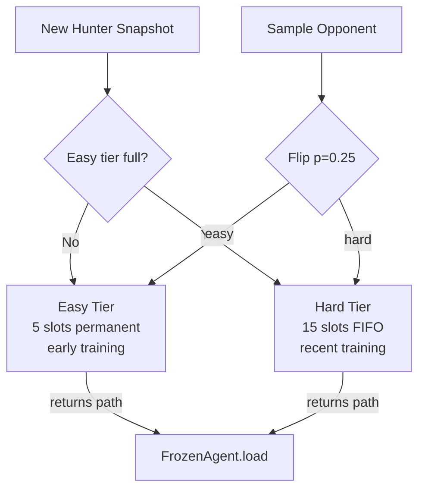

# Architecture: Resolving Strategy Bimodality via Gated Option Policies and Counterfactual HER

## Problem

After 6000 episodes of vanilla FSP (Fictitious Self-Play), Krishna learned to evade extremely well but developed **collection paralysis** — it never approached pellets even when the Hunter was far away. The replay buffer filled with evasion-only transitions. The FSP pool evicted all early-game (easy) snapshots and contained only strong late-game Hunters. Krishna had no safe practice time to learn collection.

**Bimodal failure pattern**: either evade (survive but 0 pellets, timeout) or get caught (lose fast). The win condition (4 pellets) was never reliably reached after ep 1802.

---

## Solution Architecture

Two complementary mechanisms are combined:

1. **Gated Option Policies (GOP)** — A single Q-network with two specialized heads (evade / collect) and a learned gate that blends them based on tactical context (Hunter distance, remaining pellets, remaining lives).
2. **Counterfactual HER (CHER)** — Post-episode relabeling that scans completed trajectories for "safe collect opportunities" Krishna missed, and injects counterfactual transitions with a collection bonus.

---

## System Overview



---

## Gated Option Network



**Gate semantics:**
- `gate = 1.0` → pure evasion (Hunter very close, lives low)
- `gate = 0.0` → pure collection (Hunter far, pellets remaining)
- Intermediate → soft blend of both strategies

The gate is trained end-to-end by gradient descent through the Q-learning loss — no separate supervised signal needed. Over time it learns that high hunter proximity should activate evasion mode.

### Context Vector (3 components)

| Index | Value | Normalization |
|-------|-------|--------------|
| 0 | Hunter Manhattan distance | ÷ (2 × grid_size) |
| 1 | Pellets remaining | ÷ target_pellets (4) |
| 2 | Lives remaining | ÷ max_lives (3) |

All components ∈ [0, 1].

---

## Counterfactual HER

```mermaid
sequenceDiagram
    participant LOOP as Training Loop
    participant ENV as Environment
    participant BUF as Replay Buffer
    participant CHER as CounterfactualHER

    LOOP->>ENV: reset()
    loop each step
        LOOP->>ENV: step(actions)
        ENV-->>LOOP: state, rewards, info
        LOOP->>BUF: add real transition
        LOOP->>LOOP: accumulate trajectory
    end
    LOOP->>CHER: relabel(trajectory)
    note over CHER: For each step where<br/>hunter_dist > 6 AND<br/>pellet_dist ≤ 4 AND<br/>Krishna didn't move<br/>toward pellet:
    CHER-->>CHER: optimal_action = argmin_dist(krishna→pellet)
    CHER-->>CHER: cf_reward = reward + collect_bonus(30)
    CHER-->>LOOP: List[cf_transitions]
    LOOP->>BUF: add_batch(cf_transitions)
```

**Key invariant**: counterfactual transitions use the *same* `state` / `next_state` as the real transition — only `action` and `reward` are modified. This is valid because the actual environment dynamics are unchanged; we are asserting "if Krishna had moved toward the pellet, it would have received this reward."

### CHER Parameters

| Parameter | Default | Meaning |
|-----------|---------|---------|
| `hunter_safe_dist` | 6 | Hunter must be more than this many cells away |
| `pellet_reach` | 4 | Nearest pellet must be within this many cells |
| `collect_bonus` | 30.0 | Reward added to counterfactual transition |
| `max_cf_per_ep` | 50 | Cap per episode to prevent buffer flooding |

---

## Hierarchical Opponent Pool



**Why two tiers?** In v4 training the FIFO pool evicted all early-game Hunters by ep 2000. The easy tier permanently preserves weak opponents so Krishna always has safe practice time regardless of how strong the hard tier becomes.

---

## Training Loop

```mermaid
flowchart TD
    START[Start Episode] --> MODE{Flip p_latest=0.7}
    MODE -->|joint 70%| JOINT[Both agents learn]
    MODE -->|fsp 30%| FSP[Krishna learns vs frozen Hunter]
    JOINT --> RESET[env.reset]
    FSP --> LOAD[HierarchicalPool.sample\np_easy=0.25]
    LOAD --> RESET
    RESET --> LOOP[Step Loop]
    LOOP --> ACT[krishna.act(state, context)]
    ACT --> STEP[env.step]
    STEP --> STORE[krishna.step: store + learn every 4 steps]
    STORE --> TRAJ[Append to trajectory]
    TRAJ --> DONE{done or trunc?}
    DONE -->|No| LOOP
    DONE -->|Yes| CHER_CALL[CounterfactualHER.relabel]
    CHER_CALL --> INJECT[buffer.add_batch(cf_experiences)]
    INJECT --> DECAY[Decay epsilons]
    DECAY --> SNAP{ep % 100?}
    SNAP -->|Yes| POOL_ADD[HierarchicalPool.add_snapshot]
    SNAP -->|No| AVGCK[Update rolling avg100]
    POOL_ADD --> AVGCK
    AVGCK --> BEST{avg100 improved?}
    BEST -->|Yes| SAVE[Save krishna_best.pth]
    BEST -->|No| NEXT[Next Episode]
    SAVE --> NEXT
```

---

## File Map

```
model/
  cnn_q_network.py          Phase 2: standard Dueling CNN (baseline)
  gated_option_network.py   Phase 3: GOP — dual heads + gate MLP

agent/
  dqn_v2_agent.py           Phase 2: standard DQN agent + FlatReplayBuffer
  gated_dqn_agent.py        Phase 3: GOP agent + ContextReplayBuffer + info_to_context()
  frozen_agent.py           Frozen opponent wrapper (shared)
  opponent_pool.py          OpponentPool: single-tier FIFO (Phase 2)

utils/
  cher.py                   CounterfactualHER — relabeling module
  hierarchical_pool.py      HierarchicalOpponentPool — 2-tier pool (Phase 3)
  state_encoder.py          Grid → (6,25,25) channel encoding (shared)
  replay_recorder.py        JSONL replay file writer (shared)

environment/
  selfplay_env.py           SelfPlayGridworld — enriched info dict with distances

train_phase2.py             Phase 2 training script (baseline, preserved)
train_phase3.py             Phase 3 training script (GOP + CHER + HierPool)
```

---

## Key Numbers (v4 baseline vs v5 target)

| Metric | v4 (6000 eps) | v5 target |
|--------|--------------|-----------|
| Krishna wins | 6 (0.1%) | >50 (>0.4%) |
| avg pellets / joint episode | 0.35 | >1.0 |
| avg100 peak | +4.9 (ep 5300) | >+15 by ep 6000 |
| avg100 sustained | −23 (final) | >+5 sustained |
| Collection paralysis | Yes | Resolved by CHER |
| Gate collapse risk | N/A | Monitor via `mean_gate` CSV column |

### v5 Hyperparameters

```python
# Warm-start from v4 ep5300 checkpoint
warm_start = "training_runs/20260606_175631_phase2_v4_nowall/checkpoints/krishna_best_ep5300.pth"
epsilon_start = 0.15     # already near floor from warm-start
episodes     = 12000     # 2x v4 for CHER to accumulate signal
cher_bonus   = 30.0      # collect_bonus per counterfactual transition
cher_safe_dist = 6       # Hunter must be >6 cells away
cher_pellet_reach = 4    # Pellet must be ≤4 cells away
easy_tier = 5            # permanent early-game snapshots
hard_tier = 15           # FIFO recent snapshots
```

---

## Launch Command

```bash
python train_phase3.py \
  --episodes 12000 \
  --device mps \
  --name phase3_v1_gop_cher \
  --warm-start training_runs/20260606_175631_phase2_v4_nowall/checkpoints/krishna_best_ep5300.pth \
  --epsilon-start 0.15
```

Progress is logged to `training_runs/<run_id>/logs/episode_stats.csv` with columns including `mean_gate` and `cf_injected`.
