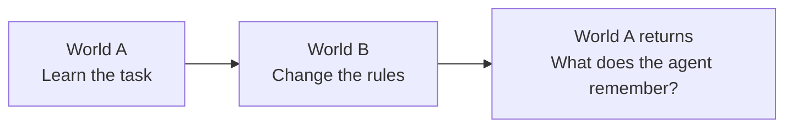

# Q6

**Learn a world. Change the rules. See what sticks.**

A pellet. A few walls. Thirty-two moves. Enough room for a neural network to surprise you.

Q6 is a research lab for small agents learning across changing worlds. The ambition is simple to describe and difficult to get right: build worlds we can run cheaply, agents whose mistakes we can inspect, and experiments that explain what they learn—and what survives when the rules change.



We’re building toward that loop. The first adaptation pilots exposed a more immediate problem: the agent had not reliably learned the starting task. So the current work asks **what experience helps the same small network learn useful behavior across maps?** Memory comes after that foundation.

**Public research preview.** The current code and evidence live on [`q6-adaptation-lab`](https://github.com/rahul-tiwari-95/Q6/tree/q6-adaptation-lab), with integration tracked in [PR #1](https://github.com/rahul-tiwari-95/Q6/pull/1). A license has not yet been selected.

## Start by watching

The dashboard lets you step through a policy’s decisions, see its predicted action values, compare them with exact values, and inspect the experience used for training. The active movement rule is visible from the first frame. Successful runs and awkward failures both stay in the record.

```bash
git clone --branch q6-adaptation-lab https://github.com/rahul-tiwari-95/Q6.git
cd Q6
python3 -m http.server 8080 --bind 127.0.0.1
```

Open **[the lab](http://127.0.0.1:8080/dashboard/lab.html#coverage)**. No training is required to explore the shipped results.

Start with **Experience coverage → Map-balanced replay**. On the first map, bank 1 / seed 0 improves from 30 to 15 steps; seed 2 changes from a 14-step success to failure. Switch learners, then look at the averages. There are **1,402 saved recordings** across the current studies, plus the earlier research dashboards.

## A few things the worlds have taught us

- **A score can change without a single weight changing.** The same set of three collected policies scored 68.2% success on one evaluation panel and 83.9% on another. That prompted prospective evaluation across eight new panels. [Follow the panel story →](https://github.com/rahul-tiwari-95/Q6/blob/q6-adaptation-lab/docs/experiments/panel_evaluation_results_v1.md)
- **The amount of experience is only part of the story.** Across three comparisons with size matched within each pair, uniformly selected states improved efficient success by 17.1, 27.7 and 23.3 percentage points over trajectory-collected states. “Efficient” means reaching the goal within twice the shortest-path length, with failures counted. [Inspect the bank comparisons →](https://github.com/rahul-tiwari-95/Q6/blob/q6-adaptation-lab/docs/experiments/bank_replication_results_v1.md)
- **A sensible intervention can have a mixed result.** Giving every map equal replay probability improved two banks and harmed one: −3.9, +7.2 and +4.6 efficiency points. Exposure became nearly equal, but some sparse-map states were repeated more than a thousand times. We kept the original replay as the baseline. [Read the latest completed experiment →](https://github.com/rahul-tiwari-95/Q6/blob/q6-adaptation-lab/docs/experiments/map_replay_results_v1.md)

These are bounded findings from a fully visible toy world and a **20,420-parameter feedforward network**. The offline studies still give the learner transitions for all four actions, including actions the collector did not take. They do not establish online-RL competence, general intelligence or a memory mechanism.

## Where Q6 is headed

| Step | The question | What would count as progress? |
| --- | --- | --- |
| **Now: experience composition** | Which states help an agent learn across maps? | Controlled comparisons that preserve the network, training budget and relevant sampling conditions. |
| **Next: learn from actual experience** | Can useful behavior survive when training uses only recorded actions and transitions? | A reproducible bridge from privileged offline experiments toward online learning. |
| **Then: adaptation and retention** | What remains when A changes to B and A returns? | Competent starting policies, then fair retained/reset/replay and memory comparisons. |
| **Make more worlds affordable** | How much simulation and learning can we do with a stated compute budget? | Measured throughput, memory and behavior under sequential and batched execution. |

**The next control is within-map state composition.** Keep each map’s exact state count and the original replay schedule, but change which states fill those slots. That holds map exposure and batch diversity fixed. It has not run yet.

Recurrent memory and nested learning remain future experiments. They earn a place when a repeatable limitation gives us a concrete reason to add them. The [roadmap](https://github.com/rahul-tiwari-95/Q6/blob/q6-adaptation-lab/docs/roadmap.md) records those decisions.

## Try an experiment on CPU

From the research checkout above, use Python 3.10 or later; Python 3.12 matches the current reference runs.

```bash
python3.12 -m venv .venv
source .venv/bin/activate
python -m pip install -e '.[dev]'

# Small execution check. Choose a new output directory each time.
python -m q6.map_replay \
  --output /tmp/q6-map-replay-smoke \
  --protocol-file docs/experiments/map_replay_protocol_v1.md --smoke
```

Smoke reuses the shipped supports and archived controls, trains three treatments for 24 updates each, and evaluates four alternate maps. Its unequal treatment/control budgets check execution only; smoke is ineligible research evidence.

The latest main comparison took **about three minutes on one CPU thread**, peaking at **0.45 GiB process memory** on the reference Mac. This is one observed run, not a cross-machine benchmark. Full reproduction commands, pinned versions, fixed budgets and audit instructions are in the [experiment report](https://github.com/rahul-tiwari-95/Q6/blob/q6-adaptation-lab/docs/experiments/map_replay_results_v1.md) and [validation record](https://github.com/rahul-tiwari-95/Q6/blob/q6-adaptation-lab/docs/validation/map-replay-v1.md).

## Bring a good question

Useful contributions include reproducing a result, finding a missing control, explaining a failure visible in a replay, improving inspection tools, or measuring a simulation bottleneck. A well-explained negative result belongs here.

Start with the [contribution guide](https://github.com/rahul-tiwari-95/Q6/blob/q6-adaptation-lab/CONTRIBUTING.md), [documentation index](https://github.com/rahul-tiwari-95/Q6/blob/q6-adaptation-lab/docs/README.md) and [citation metadata](https://github.com/rahul-tiwari-95/Q6/blob/q6-adaptation-lab/CITATION.cff). The current modules are packaged for experimentation; their APIs are still evolving.

## The history stays

Q6 began with **Krishna–Hunter self-play**, then explored reward incentives, policy heads, replay, and a separate **No Way Home** provenance idea. That companion study asks how repeated evidence should be counted in a synthetic decision task; it has its own [bounded results and limitations](https://github.com/rahul-tiwari-95/Q6/blob/q6-adaptation-lab/docs/experiments/provenance-results.md).

The [research review](https://github.com/rahul-tiwari-95/Q6/blob/q6-adaptation-lab/research_review/2026-09-05/README.md), [version log](https://github.com/rahul-tiwari-95/Q6/blob/q6-adaptation-lab/versions/README.md), [articles](https://github.com/rahul-tiwari-95/Q6/tree/q6-adaptation-lab/articles) and [original narrative](https://github.com/rahul-tiwari-95/Q6/blob/q6-adaptation-lab/Q6.md) preserve the experiments, corrections and changes of direction. Older ablations and the PPO port remain on [`v7-ablations`](https://github.com/rahul-tiwari-95/Q6/tree/v7-ablations) and [`v8`](https://github.com/rahul-tiwari-95/Q6/tree/v8). Some legacy summaries lack their original artifacts; the current documentation identifies those limits.
