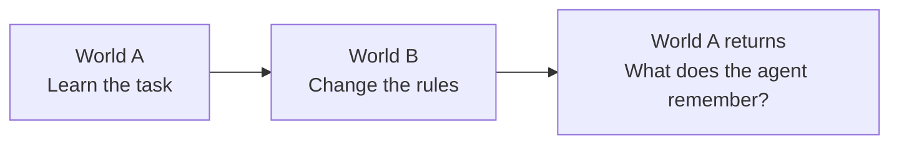

# Q6

**Learn a world. Change the rules. See what sticks.**

A pellet. A few walls. Thirty-two moves. Enough room for a neural network to surprise you.

Q6 is a research lab for small agents learning across changing worlds. The ambition is simple to describe and difficult to get right: build worlds we can run cheaply, agents whose mistakes we can inspect, and experiments that explain what they learn—and what survives when the rules change.



We’re building toward that loop. The first adaptation pilots exposed a more immediate problem: the agent had not reliably learned the starting task. So the current work asks **what experience helps the same small network learn useful behavior across maps?** Memory comes after that foundation.

**Public research preview.** The current code and evidence live on [`q6-adaptation-lab`](https://github.com/rahul-tiwari-95/Q6/tree/q6-adaptation-lab), with integration tracked in [PR #1](https://github.com/rahul-tiwari-95/Q6/pull/1). A license has not yet been selected.

## Start by watching

The dashboard lets you step through a policy’s decisions, see its predicted action values, compare them with exact values, and inspect the experience used for training. The active movement rule is visible from the first frame. Successful runs and awkward failures both stay in the record.

```bash
git clone --branch q6-adaptation-lab https://github.com/rahul-tiwari-95/Q6.git
cd Q6
python3 -m http.server 8080 --bind 127.0.0.1
```

Open **[the lab](http://127.0.0.1:8080/dashboard/lab.html#coverage)**. No training is required to explore the shipped results.

Start with **Experience coverage → Guided collection**. On the first preset collection map, bank 1 / episode slot 8, random wandering takes 26 moves; a frozen DDQN takes two. The journeys improve, the experience bank shrinks, and fresh-map efficiency falls **49.1% → 43.3%**. Watch the routes, inspect the experience bank, and follow the mismatch. There are **3,338 saved recordings** across the current studies, plus the earlier research dashboards.

## A few things the worlds have taught us

- **A score can change without a single weight changing.** The same set of three collected policies scored 68.2% success on one evaluation panel and 83.9% on another. That prompted prospective evaluation across eight new panels. [Follow the panel story →](https://github.com/rahul-tiwari-95/Q6/blob/q6-adaptation-lab/docs/experiments/panel_evaluation_results_v1.md)
- **A sensible intervention can have a mixed result.** Giving every map equal replay probability improved two banks and harmed one: −3.9, +7.2 and +4.6 efficiency points. Exposure became nearly equal, but some sparse-map states were repeated more than a thousand times. We kept the original replay as the baseline. [Inspect the replay experiment →](https://github.com/rahul-tiwari-95/Q6/blob/q6-adaptation-lab/docs/experiments/map_replay_results_v1.md)
- **Same maps. Same batch order. Different states.** Replacing states within each map while preserving its exact quota and replay schedule raised efficient success from **45.7% to 68.7%**. All 24 bank-panel averages improved. Which states fill the experience bank matters even when map exposure stays fixed. [Inspect the composition control →](https://github.com/rahul-tiwari-95/Q6/blob/q6-adaptation-lab/docs/experiments/within_map_results_v1.md)
- **What if the learner only gets recorded outcomes?** Keeping the original collected states and replay fixed, but removing outcomes for unrecorded actions, cut efficient success from **43.0% to 21.3%** on new common panels. The logs cover only about 35% of the four possible actions at each collected state, averaged across those states. This exposed how much the earlier procedure relied on broader supervision. [Inspect the recorded-outcome control →](https://github.com/rahul-tiwari-95/Q6/blob/q6-adaptation-lab/docs/experiments/recorded_actions_results_v1.md)
- **A smaller training-time choice can produce better routes.** Letting the bootstrap choose only actions logged at its successor raised efficient success from **22.7% to 49.5%**, with exactly the same data, replay and target count. Every bank-panel average improved in efficiency; overall success rose more modestly, **66.2% → 69.5%**. Fresh policies still choose among all four actions. [Inspect the bootstrap control →](https://github.com/rahul-tiwari-95/Q6/blob/q6-adaptation-lab/docs/experiments/constrained_bootstrap_results_v1.md)

- **Better answers to the training problem can produce worse decisions.** Solving the logged transition graph exactly cut value error by **54%**, yet fresh-map efficient success fell **48.7% → 18.6%**. Every bank-panel average declined. Fitting recorded values and choosing useful actions are different achievements—and Q6 keeps both in view. [Inspect the exact-label comparison →](https://github.com/rahul-tiwari-95/Q6/blob/q6-adaptation-lab/docs/experiments/logged_graph_results_v1.md)

- **The logs are a record, not the limit of a useful policy.** On identical familiar starts, restricting choices to logged actions cut DDQN efficiency **68.5% → 40.8%**. It did not restore exact-label efficiency either: **25.8% → 24.0%**. Even the best logged routes allow only **60.9%** efficient success; DDQN sometimes finds useful shortcuts beyond them. The regression also includes worse ranking among recorded actions, so blocking unrecorded choices cannot explain or fix it all. [Read the frozen-policy investigation →](https://github.com/rahul-tiwari-95/Q6/blob/q6-adaptation-lab/docs/experiments/familiar_starts_results_v1.md)

- **Better journeys can leave a weaker student.** Replacing eight of sixteen random episodes per map with frozen-policy-guided episodes raised the logs’ efficient-route ceiling **60.9% → 82.3%**, but fresh efficient success fell **49.1% → 43.3%** across all three bank averages. The mixture collected fewer unique states and actions. A good demonstration and a useful learning bank are different things. [Inspect the collection experiment →](https://github.com/rahul-tiwari-95/Q6/blob/q6-adaptation-lab/docs/experiments/guided_collection_results_v1.md)

“Efficient” means reaching the goal within twice the shortest-path length, with failures counted. These are bounded findings from a fully visible toy world and a **20,420-parameter feedforward network**. Earlier offline arms receive outcomes for all four actions; the current DDQN comparisons learn from logged outcomes only, with training-time successor choices restricted to logged actions. Fresh policies choose among all four actions. The latest collection experiment uses one previously trained, frozen collector, then trains new students through offline deduplicated state replay. Its route ceilings describe familiar recorded graphs, not fresh-policy limits. None of this establishes online-RL competence, general intelligence or a memory mechanism.

## Where Q6 is headed

| Step | The question | What would count as progress? |
| --- | --- | --- |
| **Established control: experience composition** | Which states help an agent learn across maps? | Within-map replacements improve efficiency across three banks with map exposure and batch diversity fixed. |
| **Now: learn from actual experience** | Can useful behavior survive when training uses only recorded actions and transitions? | Retain constrained DDQN with random collection; test which experience improves fresh behavior when efficient demonstrations alone are insufficient. |
| **Then: adaptation and retention** | What remains when A changes to B and A returns? | Competent starting policies, then fair retained/reset/replay and memory comparisons. |
| **Make more worlds affordable** | How much simulation and learning can we do with a stated compute budget? | Measured throughput, memory and behavior under sequential and batched execution. |

**Next: separate the value of guidance from the exploration it replaced.** Keep the original random-collection DDQN baseline. Using the existing logs, train on just the same eight retained random episodes per map, then compare with both frozen endpoints on common new panels. This will show whether guidance helps, hurts, or fails to compensate for dropping the other eight random episodes. Keep the network and training budget fixed; no new collection is needed. The next comparison has not run, and continuous online feedback remains deferred.

Recurrent memory and nested learning remain future experiments. They earn a place when a repeatable limitation gives us a concrete reason to add them. The [roadmap](https://github.com/rahul-tiwari-95/Q6/blob/q6-adaptation-lab/docs/roadmap.md) records those decisions.

## Try an experiment on CPU

From the research checkout above, use Python 3.10 or later; Python 3.12 matches the current reference runs.

```bash
python3.12 -m venv .venv
source .venv/bin/activate
python -m pip install -e '.[dev]'

# Small execution check. Choose a new output directory each time.
python -m q6.guided_collection \
  --output /tmp/q6-guided-collection-smoke \
  --protocol-file docs/experiments/guided_collection_protocol_v1.md --smoke
```

Smoke collects one complete bank of 4,096 episodes, performs 24 learner updates and checks a small fresh evaluation with 44 recorded journeys. The archived control has a much larger training budget, so smoke checks execution only and is ineligible research evidence.

The latest main comparison took **3 minutes 6 seconds on one CPU thread**, peaking at **0.56 GiB process memory** on the reference Mac. It used **203,113 collection interactions**, versus the controls’ 301,585, under equal episode allocation. The collector also brings **100,878 prior interactions and 30,000 training updates**; this is not an equal-total-history comparison. Full commands, pinned versions, fixed budgets and audits are in the [experiment report](https://github.com/rahul-tiwari-95/Q6/blob/q6-adaptation-lab/docs/experiments/guided_collection_results_v1.md) and [validation record](https://github.com/rahul-tiwari-95/Q6/blob/q6-adaptation-lab/docs/validation/guided-collection-v1.md).

## Bring a good question

Useful contributions include reproducing a result, finding a missing control, explaining a failure visible in a replay, improving inspection tools, or measuring a simulation bottleneck. A well-explained negative result belongs here.

Start with the [contribution guide](https://github.com/rahul-tiwari-95/Q6/blob/q6-adaptation-lab/CONTRIBUTING.md), [documentation index](https://github.com/rahul-tiwari-95/Q6/blob/q6-adaptation-lab/docs/README.md) and [citation metadata](https://github.com/rahul-tiwari-95/Q6/blob/q6-adaptation-lab/CITATION.cff). The current modules are packaged for experimentation; their APIs are still evolving.

## The history stays

Q6 began with **Krishna–Hunter self-play**, then explored reward incentives, policy heads, replay, and a separate **No Way Home** provenance idea. That companion study asks how repeated evidence should be counted in a synthetic decision task; it has its own [bounded results and limitations](https://github.com/rahul-tiwari-95/Q6/blob/q6-adaptation-lab/docs/experiments/provenance-results.md).

The [research review](https://github.com/rahul-tiwari-95/Q6/blob/q6-adaptation-lab/research_review/2026-09-05/README.md), [version log](https://github.com/rahul-tiwari-95/Q6/blob/q6-adaptation-lab/versions/README.md), [articles](https://github.com/rahul-tiwari-95/Q6/tree/q6-adaptation-lab/articles) and [original narrative](https://github.com/rahul-tiwari-95/Q6/blob/q6-adaptation-lab/Q6.md) preserve the experiments, corrections and changes of direction. Older ablations and the PPO port remain on [`v7-ablations`](https://github.com/rahul-tiwari-95/Q6/tree/v7-ablations) and [`v8`](https://github.com/rahul-tiwari-95/Q6/tree/v8). Some legacy summaries lack their original artifacts; the current documentation identifies those limits.
